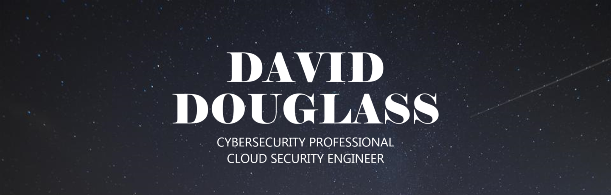

<h1 align="center">Hello, I am David. 👋</h1>
<h3 align="center">A passionate Cybersecurity professional and Cloud Security Engineer committed to protecting data and enhancing cybersecurity measures in the cloud.</h3>
  

 This Github repositorty is meant to showcase my entire Cybersecurity journey and the projects I've done during it.

I've had the pleasure of working hard to increase my cybersecurity and cloud security engineering skills.  Most times it doesn't feel like work because I loved every moment of it, even the frustrating times when I had to troubleshoot issues in my projects.

You are invited to explore my GitHub portfolio to get a glimpse into my technical capabilities. These projects showcase insights into my problem solving approach, attention to detail, and ability to analyze risks and implement appropriate mitigation strategies.

---

  
  

<h2>  🖥️ Projects  :</h2>

<h2>👨🏻‍💻 🌎 🔐 Cyber Security Projects 👨🏻‍💻 🌎 🔐</h2>
  
  
  - [Creating a Live SOC / Honey Net in Azure](https://github.com/AmiliaSalva/Azure-Honey-Net-SOC)
  - 
    
 ---
  
  

  ## XXX Projects
  - 
  
  
  
 ---
  
  

 ## XXXX Projects
  -

  
 
  
  
  
  

 ---
  
  

  ## KQL Simple Queries
   - [Enhancing Security with KQL: Understanding Successful User Logins and Logon Types](https://github.com/AmiliaSalva/KQL-Queries)
  
 
 
<h2> 📲 connect with me:</h2>
  
[linkedin](images.linked.png)

[linkedin]: https://www.linkedin.com/in/david-douglass-67876441/

